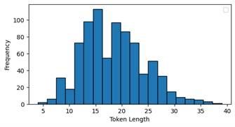
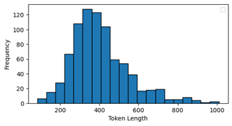
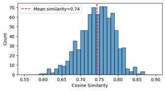
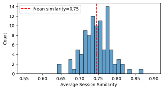

# AI Tools and Text Embedding for Session Organization at ASABE's Annual International Meeting

## Highlights

-   Text embedding models enable automated determination of the
    similarity between sessions.

-   Procedures to use metrics based on similarity scores to identify
    focused and unfocused sessions and outlier presentations are
    provided.

-   Model clustering ability is more critical for this application than
    the maximum length of input text.

**Abstract.** Four text embedding models
(nomic-embed-text-v1.5, cde-small-v1, all-mpnet-base-v2, and
all-MiniLM-L6-v2) were used to create dense vector representations of
the topics of the titles and abstracts of all 810 oral presentations
that were given at the American Society of Agricultural and Biological
Engineers’ 2024 Annual International Meeting. Similarities between all
these presentations were then calculated through cosine similarity.
Metrics for characterizing presentations and their relationship to their
assigned session were created: Presentation-Session Similarity, Raw
Deviation, and Standardized Deviation. To describe the level of
similarity within a session, session metrics were established: Session
Similarity and Session Standard Deviation. Examples of using these
metrics to identify very focused sessions as well as unfocused sessions
are provided. Outlier presentations are identified using the
Standardized Deviation and potentially more suitable sessions for the
presentation are identified using similarity scores. A final metric,
Session-Session Similarity identifies the similarity in topics between
different sessions, which can assist in scheduling to ensure highly
related sessions are not scheduled at the same time. The outputs of the
four different models were compared through Pearson correlations of the
similarity scores, which ranged between 0.79 and 0.88. Since the models
differed on the maximum quantity of input text and thus the length of
the abstracts that they could process, all models were again tested with
inputs truncated to the first 256 tokens. These input limits only had
slight impacts on outputs with Pearson correlations above 0.96 between
truncated and non-truncated tests of the same model. The differences in
clustering quality as measured by model benchmark scores were more
impactful than the length of the abstract that the model could process.
Based on these results, efforts will continue with the more powerful
embedding models and a web app has been built that will enable session
organizers to consider similarity metrics as they organize AIM 2025.

**Keywords.** Text Embedding, Session Organization, ASABE Annual
International Meeting, Artificial Intelligence, Similarity Metrics.

Properly sorting oral research presentations into sessions (session
organization) has been a major challenge and source of attendee
discontent at ASABE’s Annual International Meeting (AIM) for many years.
While there has been considerable effort to improve the process, it is
difficult to accurately assess and classify the over 800 oral
presentations that are given at a normal ASABE AIM. The current process
starts with technical committees trying to guess the best possible
session titles for the next AIM. These guesses create the initial set of
session names. Overall, about 100 sessions are created, and session
organizers are appointed for each one. About six months before the
conference, presenters submit their presentation to one of the proposed
sessions. Some sessions end up with very few submissions and others end
up with inundated with submissions. Unfortunately, many of the submitted
presentations are only marginally related to the original idea for the
session topic that was proposed at the previous AIM. Over the next
several months, session organizers, technical community program chairs
and conference program chairs reorganize and refine the sessions by
swapping presentations and merging and subdividing sessions to attempt
to create coherent groupings.

With over 800 oral presentations, it is not possible for one person to
read every presentation abstract to identify themes and sort
presentations even if this person could somehow be up to date with all
the active research in every area of agricultural and biological
engineering. Despite the best efforts of a large team of volunteers, the
fragmented nature of the process makes this difficult. Each session
organizer oversees a topic based on the session name they originally
proposed. Unfortunately, many presentations are left stranded in
sessions that are not good fits because the session organizers were
unaware that other relevant presentations were submitted to other
sessions. Additionally, much of the research at AIM is
cross-disciplinary, and it is not immediately clear which session
organizer should be placing the presentation. Over the past ten years,
the ASABE Meetings Council has tried a variety of methods to share and
organize the presentations to help session, community and program
organizers better visualize and sort the presentations. There was even
an ill-fated attempt to use keywords and automated sorting. Recent
advancements in Natural Language Processing and AI have finally provided
tools that could be very useful in assisting session organizers with
their task.

## Natural Language Processing and Generative AI

Generative AI enabled by LLMs represents a significant advancement in
AI. Coming out of the field of Natural Language Processing (NLP), LLMs
are neural networks that map concepts at a deeper level than earlier
predictive AI models (Templeton et al., 2024). They are trained on vast
amounts of text data using self-supervised learning techniques –
primarily next-token prediction. This training process allows LLMs to
understand context, write coherent text passages (Ahn, 2024), and
perhaps most surprisingly, perform complex reasoning (Sprague et al.,
2024).

Current LLMs use the transformer architecture developed by Vaswani et
al. (2017) which relies on the attention mechanism for modifying model
weights rather than using convolution or recurrent neural networks.
Early LLMs utilized a string-based interface where the model received a
text string and then returned a string as an output (LangChain, 2024c).
However, LLMs and the tools that utilize them to create various
applications are all rapidly developing. At the time of writing, the
current chat model interface generally consists of an array of messages
which are called the prompt (LangChain, 2024a). Designing this prompt is
prompt engineering – not to be confused with questions typed into a
website text box. Each message within the prompt can include roles and
instructions in addition to the message itself which helps the model
determine how to interpret the input (OpenAI, 2024). Various
instructions and even memories of previous actions can be embedded into
the prompt.

This ability to augment the prompt has also enabled techniques like
Retrieval-Augmented Generation (RAG) which adds limited segments
retrieved from a designated datastore to the prompt. The basic three
step RAG process was introduced by Lewis et al. (2020). In Retrieval,
the initial query is assessed and documents similar the query are
identified in the knowledge base. The newly retrieved information is
then used to Augment the original prompt, and the new combined prompt is
passed to the LLM to provide context to Generate the response
(LangChain, 2024b). This process has proven useful by allowing the LLM
to ground answers using specific, reliable information. It also ensures
answers are based on up to date information (Google, 2024; Lewis et al.,
2020; Wang et al., 2024).

Various methods can be used to identify relevant information for RAG
(Amazon Web Services, 2024; Google, 2024), but the initial and still
most common approach is to compare a dense vector representation of the
query with a dense vector representation of the information segments in
the knowledge store (Lewis et al., 2020). These dense vector
representations are created using embedding language models. Like
generative LLMs, embedding models are neural networks trained on a large
corpus of text. However, the output from these models is a dense vector
that captures the semantic meaning of the text in that document (Reimers
and Gurevych, 2019). Similarities between the information segments and
the query are then determined by comparing the dense vector
representations – frequently using cosine similarity (Reimers and
Gurevych, 2019). These powerful text embedding models can also be used
for other text tasks like clustering or reranking in addition to
identifying matches between queries and information documents
(Muennighoff et al., 2023). These additional applications of embedding
models were utilized in this project to identify similarities between
research presentations.

## Generative AI and NLP Applications in Agriculture

This project is not alone in applying the recent advancements in
generative AI and NLP to agricultural applications. Agriculture
researchers have rapidly begun considering potential uses of this
quickly advancing technology. One proposal is to use LLMs to
automatically classify agricultural injury reports to implement targeted
interventions at more local scales (Muller et al., 2024). Other have
identified many potential applications in outreach and communication of
best practices for safe agricultural work (Shutske, 2023; Shutske et
al., 2025). While these tools are undeniably helpful in some
applications, their use can also present challenges – such as when used
in disinformation campaigns that negatively impact agricultural
operations (Stephen et al., 2024) or to circumvent grading procedures in
university biosystems engineering courses (Moore and Sadler, 2023).
Others have looked beyond basic text generation and used generative AI
to create a foundation model for understanding orchard fruit (Li et al.,
2024). This powerful model can identify and select fruit in images based
on requirements provided through natural language prompts. In another
project that extends generative AI beyond text generation, Eckhardt et
al. (2024) used generative AI to create synthetic data to simulate the
response of cattle to different climate change scenarios.

Before the current crop of generative AI models based on NLP, generative
techniques, and especially Generative Adversarial Networks (GANs) had
proven useful for machine vision applications. Notable applications of
GANs in agriculture include the works of Song et al. (2021) to identify
apple diseases, the project by Ufuah et al. (2022) for post-harvest
classification of date fruit and the advances by Yu et al. (2025) to
create super-resolution reconstructions of Maize Tassels for crop growth
assessment. Outside of GANs, a project by Bar-Shira et al. (2023)
developed a method to synthesize artificial date fruit images based on
3D models. While generative AI tools were not developed with
agriculture-specific applications in mind, these powerful, general
purpose tools are proving adept at working with complex agricultural and
biological systems. With this project, we investigate the ability for
these generative AI and NLP tools to properly determine the semantic
meaning of research in a wide variety of agricultural and biological
engineering topics.

## Objectives

The specific objectives of this study are to:

-   Use text embeddings from generative AI systems to determine semantic
    similarity between presentations.

-   Use similarity scores to analyze traditional human organized
    sessions

-   Present metrics and procedures to use these metrics to identify:

    -   sessions with high similarity,

    -   sessions with low similarity, and

    -   outlier presentations.

-   Determine the characteristics of text embedding models that work
    well for session organization.

# Materials and Methods

## Using Text Embeddings to Calculate Similarity

The source of data for this project was the main presentation planning
spreadsheet used for organizing presentations at ASABE’s 2024 Annual
International Meeting. This spreadsheet included 810 oral presentations
that had been organized into normal oral sessions. This total does not
include posters, invited speakers or panel discussions. The 810 oral
presentations were all normal presentations that were submitted in
response to the Call for Papers. They included standard (12 minute) and
lightning (5 minute) oral presentations. These presentations could have
been placed in traditional or lightning sessions or hybrid sessions
where they were combined with invited speakers or panel discussions.

This data source included the following information for each
presentation:

-   Title

-   Abstract

-   Session

-   Presenter Last Name

-   Presenter First Name

-   Abstract ID

-   Technical Community

This data was the final organizing spreadsheet after the conference.
Therefore, the Session field reflects the session within which the
presentation was given at the conference after all organizing changes
had been made. The Technical Community is the technical community which
sponsored and organized the Session. The Title and Abstract are the
versions that were submitted in the original Call for Papers. These are
the versions that were used to create and organize the sessions
originally. Some authors edited their titles shortly before the
conference, but this project focused on the work of the conference
organizers, so the versions available to them during conference
organization were used. All this data except for the abstracts and
non-edited titles were eventually published in the conference technical
program and is publicly available.

All processing was conducted in a Python Jupyter notebook using Python
3.12.4. Before processing, the Title and Abstract fields were combined
into a single line of text in the form “Title: Abstract…”, with a colon
and a space in between the two pieces of text. This provided a single
text string that contained all the topic information about the
presentation. As part of this project, four different text embedding
models were evaluated: nomic-embed-text-v1.5 (Nussbaum et al., 2024),
cde-small-v1 (Morris and Rush, 2024), all-mpnet-base-v2 (Sentence
Transformers, 2024b), and all-MiniLM-L6-v2 (Sentence Transformers,
2024a) (Table 1). All of these models are open and were downloaded from
the Hugging Face repository using the sentence-transformers 3.3.1
library (Reimers and Gurevych, 2019). The nomic-embed-text-v1.5 model
advised running the embedding process using a separate library, nomic.
This advice was followed, and the nomic-embed-text-v1.5 embeddings were
all performed with the suggested functions within the nomic 3.3.4
library. This process was run in local mode to ensure all calculations
were done on the local machine. Pandas 2.2.3 was used for managing
dataframes. All other models used the sentence-transformers functions to
calculate the embeddings and similarities. This notebook displaying all
processing steps is available in a Github repository (Dvorak, January 3,
2025/2025). The source data without abstracts is available in this
repository. Processed data including the embeddings for all
presentations is also available in the repository. While the embedding
process cannot be recreated without the abstracts, it is possible to
recreate the similarity analysis using the already computed embeddings.

<table>
<caption>
Table 1. Specifications of the text embedding models used in this
study.
</caption>
<colgroup>
<col style="width: 20%" />
<col style="width: 20%" />
<col style="width: 19%" />
<col style="width: 19%" />
<col style="width: 19%" />
</colgroup>
<thead>
<tr>
<th></th>
<th colspan="4">Model</th>
</tr>
</thead>
<tbody>
<tr>
<th></th>
<td>nomic-embed-text-v1.5</td>
<td>cde-small-v1</td>
<td>all-mpnet-base-v2</td>
<td>all-MiniLM-L6-v2</td>
</tr>
<tr>
<th>Max Input Token Length</th>
<td>8192</td>
<td>512</td>
<td>384 [a]</td>
<td>256[a]</td>
</tr>
<tr>
<th>Model Size (Parameters)</th>
<td>137 M</td>
<td>281 M</td>
<td>110 M</td>
<td>23 M</td>
</tr>
<tr>
<th>Embedding Dimensions</th>
<td>768</td>
<td>768</td>
<td>768</td>
<td>384</td>
</tr>
<tr>
<th>Release Date [b]</th>
<td>Feb 10, 2024</td>
<td>Sep 24, 2024</td>
<td>Aug 30, 2021</td>
<td>Aug 30, 2021</td>
</tr>
<tr>
<th>MTEB Leaderboard Clustering Average Score</th>
<td>43.93</td>
<td>48.32</td>
<td>43.69</td>
<td>41.94</td>
</tr>
<tr>
<th>
[a] The Hugging Face Model Card reports 512, but the
internal tokenizer truncates input above this number of tokens.

[b] Date of initial commit of model to Hugging Face
repository
</th>
<td></td>
<td></td>
<td></td>
<td></td>
</tr>
</tbody>
</table>

The models vary in several parameters. The all-MiniLM-L6-v2 and the
all-mpnet-base-v2 are early sentence transformer models released by the
Sentence Transformer team and maintained by Hugging Face itself. The
early all-mpnet-base-v2 model was developed with a focus on higher
quality as measured by the Massive Test Embedding Benchmark (MTEB) score
(MTEB, 2025; Muennighoff et al., 2023). The all-MiniLM-L6-v2 was
designed to run at least 5 times faster with only a slight loss in
quality (SBERT.net, 2024). The nomic-embed-text-v1.5 and cde-small-v1
are more recent models that focus on providing larger input token
lengths and quality. They both require considerably more processing
power/time. The cde-small-v1 model has the highest MTEB clustering
score. The nomic-embed-text-v1.5 and all-mpnet-base-v2 models had
similar clustering scores, and all-MiniLM-L6-v2 had the lowest score.

## Metrics to Evaluate Sessions and Presentation Placement

The output from the models is an embedding vector of the length given in
Table 1. All these models have been trained so that topic similarity is
determined by cosine similarity between the embedding vectors. Cosine
similarities vary from 0 to 1.0 with 1.0 indicating an perfect topic
match. While a single similarity value is useful for direct comparisons,
additional metrics are necessary when considering presentation placement
within a session. These metrics can be divided into *presentation
metrics*, which describe a presentation’s fit with its assigned session,
and *session metrics*, which describe overall fit between all
presentations in a given session.

**Presentation-Session Similarity:** This *presentation metric* is the
average cosine similarity between a presentation and all others in its
assigned session. It measures how similar a presentation is to others in
its session. It does not include a presentation's similarity with
itself, which is always 1.0.

It is calculated as:

$PSS(p_i) = \frac{1}{|s_j| - 1} \sum_{\substack{p_k \in s_j \\ p_k \neq p_i}} sim(p_i, p_k)$ (1)

where:

$PSS(p_i)$ is the Presentation-Session Similarity for presentation $p_i$,

$s_j$ is the session where presentation $p_i$ is assigned,

$|s_j|$ is the number of presentations in session $s_j$,

$p_k$ is a presentation in session $s_j$ other than $p_i$, and

$sim(p_i, p_k)$ is the cosine similarity between presentation $p_i$ and presentation $p_k$​​.

**Session Similarity:** This *session metric* is the average cosine
similarity between all presentations assigned to the same session. It is
an overall indicator of how well a session focuses on one topic.

It is calculated as:

$SS(s_j) = \frac{1}{|s_j|(|s_j| - 1)} \sum_{\substack{p_i \in s_j \\ p_k \in s_j \\ p_i \neq p_k}} sim(p_i, p_k)$$ (2)

where:

$SS(s_j)$ is the Session Similarity for session $s_j$​,

$\sum_{\substack{p_i \in s_j \\ p_k \in s_j \\ p_i \neq p_k}}$ is the sum the cosine similarities over all pairs of distinct presentations ($p_i$, $p_k$) within the session $s_j$, ignoring self-similarity, hence $p_i \neq p_k$, and

$|s_j|(|s_j| - 1)$ is number of all possible pairs of presentations $(p_i, p_k)$ within the session $s_j$.

**Session Standard Deviation:** This *session metric* is the standard
deviation of the Presentation-Session Similarity scores of the
presentations assigned to that session. It measures the variation in
Presentation-Session scores. Session Similarity is a better measure of
focus, but this metric can be used to identify sessions with outlier
presentations.

It is calculated as:

$SSD(s_j) = \sqrt{\frac{1}{|s_j| - 1} \sum_{p_i \in s_j} \left( PSS(p_i) - \overline{PSS(s_j)} \right)^2}$  (3)

where:

$SSD(s_j))$ is the Session Standard Deviation for session $s_j$, and

$\overline{PSS(s_j)}$ is the average Presentation-Session Similarity for all presentations in session $s_j$.

**Raw Deviation:** This *presentation metric* is the difference between
a presentation's Presentation-Session Similarity and its session's
Session Similarity. A direct measure of the difference in similarity of
a presentation and its session.

It is calculated as:

$RD(p_i) = PSS(p_i) - SS(s_j)$  (4)

where:

$RD(p_i)$ is the Raw Deviation for presentation $p_i$.

**Standardized Deviation:** This *presentation metric* is the Raw
Deviation of the presentation divided by the Session Standard Deviation
of the session to which it is assigned. This standardizes the similarity
difference based on the variability in a session. This is analogous to a
z-score. It is most useful for identifying single presentations that
stand out from an otherwise very focused session.

It is calculated as:

$SD(p_i) = \frac{RD(p_i)}{SSD(s_j)}$(5)

where:

$SD(p_i)$ is the Standardized Deviation for presentation $p_i$.

**Session-Session Similarity:** This *session to session metric* is the
average similarity between all presentations in one session with all
those in another session. It indicates how similar the topic of one
session is to the topic of another session.

It is calculated as:

$SSS(s_j, s_m) = \frac{1}{|s_j| \cdot |s_m|} \sum_{p_i \in s_j} \sum_{p_k \in s_m} sim(p_i, p_k)$  (6)

where:

$SSS(s_j, s_m)$ is the Session-Session Similarity between session $s_j$ and session $s_m$,

$|s_j|$ is the number of presentations in session $s_j$,

$|s_m|$ is the number of presentations in session $s_m$, and

$\sum_{p_i \in s_j} \sum_{p_k \in s_m}$ is the sum of the cosine similarities over all pairs of presentations, where $p_i$ belongs to session $s_j$ and $p_k$ belongs to session $s_m$.

## Comparing Embedding Models

Each of these four models were used to create embedding vectors and to
calculate similarities between all the oral presentations. These
similarity scores between all individual presentations were then used to
calculate all the presentation and session metrics previously described.
Finally ranked lists for presentations and sessions based on these
similarity metrics were created. The results from each text embedding
model were processed independently.

### Models and Input Token Length

While the MTEB Cluster score measures a model’s ability to create
embeddings for identifying and clustering similar types of text, input
token length plays a critical role in this application. Text longer than
the maximum input length is truncated and ignored. Placing presentations
into sessions is based on both the title and the work that is described
in the presentation’s abstract. Therefore, the model should ideally be
able to process both the title and the entire abstract.

The maximum input length is given in tokens, and each model includes a
tokenizer that converts text input into tokens prior to processing by
the model itself. While the tokenizer is a part of the model, the
tokenizers within these models all processed text in the same manner.
Running these models with the Sentences Transformer library, it was
possible to run the tokenizer process and check the output tokens. With
all these tokenizers, all the titles and abstracts were converted into
tokens of the same length. The number of tokens is roughly based on the
number of words with some differences. For example, the 11 word
presentation title, “Utilizing super capacitors to improve battery
performance in electric mobile machinery” becomes the 13 token string,
“utilizing super cap ##ac ##itors to improve battery performance in
electric mobile machinery”. If placement of presentations into sessions
was based on title alone, any of the models would be acceptable as the
longest title was less than 40 tokens long (Figure 1). Including the
abstracts increases the input token lengths substantially (Figure 2).

Figure 1. The token lengths of the title of presentations at ASABE AIM
2024 created using the tokenizer in the embedding models.

Figure 2. The token lengths of the title and abstract of presentations at
ASABE AIM 2024 created using the tokenizer in the embedding models.

Any of these models could process the titles since the longest title was
less than 40 tokens and the shortest maximum input was 256 tokens.
However, the median length of a title and abstract was 379.5 tokens. The
basic all-MiniLM-L6-v2, with its 256 token input limit, could fully
process only the shortest of presentation submissions. The
all-mpnet-base-v2 model, with its 384 token input limit, could fully
process a little more than half the presentations. Seventy-five percent
of titles and abstracts were less than 473 tokens, which cde-small-v1
could handle with its 512 token input. However, only
nomic-embed-text-v1.5 with its 8192 token maximum could handle the very
longest presentations with the maximum title and abstract length at 1010
tokens.

Since only the nomic-embed-text-v1.5 model could fully process all of
the titles and abstracts, the results from this model are used in
illustrating the general capabilities of embedding-based similarities.

After describing general capabilities, the results from the four
different models are compared. Additionally, to investigate the
importance of being able to process longer input strings, the models
were all tested with inputs that were identically truncated to 256
tokens to match the maximum input length of the small all-MiniLM-L6-v2
model. This meant that the processing steps for calculating presentation
and session similarity metrics were all repeated eight times (four
models, with full and truncated inputs). The primary method of model
comparison was to consider the Pearson correlation of the similarities
between all the presentations as estimated by each model. The raw
similarity values were not directly equivalent across models, so a
direct difference in similarity values was not possible. Using the
Pearson correlation, it is possible to focus on the relative magnitudes
of similarity which should be the same between models if they accurately
capture the true similarity between presentation topics.

# Results 

## Similarity

### Overall Similarity

All presentations given at ASABE AIM are scientific research
presentations in some area of biological or agricultural engineering.
Therefore, there is a relatively high level of similarity between them.
When considering the cosine similarity between each presentation with
all others, a distinct bell curve appears (Figure 3). With the
nomic-embed-text embeddings, the average overall similarity value is
0.64. There are some highly related presentations. The highest
similarity score is 0.96. Only 1.46% of scores are above 0.80. The least
similar presentations have a similarity score of 0.404. The average
overall similarity of 0.64 is a useful benchmark as the average
similarity between any two presentations during AIM 2024. As
presentations are assigned to sessions, they should be grouped with
presentations with which they are most similar. Therefore, similarity
within sessions should be higher than the overall average.

Figure 3. Histogram of cosine similarities for all oral presentations at
the ASABE AIM 2024 based on embeddings from the nomic-embed-text-v1.5
model.

### Presentation-Session Similarity

When comparing the similarity scores of presentations with others in
their assigned session (presentation-session similarity), 97% of
similarity scores are indeed above the general average of 0.64 (Figure
4). The average presentation-session similarity is 0.74. While most
presentations are matched with other presentations with which they are
most similar, there is still a distribution of presentation-session
similarities from a minimum of 0.60 to a maximum of 0.86.

<figure>

<figcaption>
Figure 4. Histogram of presentation-session similarity (average
cosine similarity between a presentation and all others assigned to the
same oral session) during the ASABE AIM 2024 based on embeddings from
the nomic-embed-text-v1.5 model.
</figcaption>
</figure>

### Session Similarity

Similarity scores can also be used to assess the overall similarity of
an entire sessionThe mean session similarity was 0.75, and once again,
there was a distribution of similarity scores (Figure 5). Seven sessions
had session similarity scores above 0.8, but two sessions had session
similarity scores below 0.65. However, most were grouped around the
average.

Figure 5. Histogram of session similarity within each session (for each
session, the average cosine similarity between all presentations
assigned to the same oral session) during the ASABE AIM 2024 based on
embeddings from the nomic-embed-text-v1.5 model.

A high session similarity indicates that all the presentations were
highly related within a session. Overall, only 1.46% of similarity
scores between presentations were above 0.8. Therefore, these sessions
with an average similarity above 0.8 would indicate that only the most
highly related presentations were placed together.

## Comparing Sessions

### Most and least similar sessions

To determine the ability of embedding-based similarity scores to assess
session similarity, it is necessary to move beyond the trends and
compare specific sessions. Table 2 displays the top 5 and bottom 5 most
similar sessions from AIM 2024 based on session similarity scores. The
highest session similarity came from session 330. There were only two
normal presentations in this session with the rest of the session
consisting of invited presentations. This analysis only considers the
normal oral presentations and the two normal presentations that were
selected for this session were very highly related to each other, so it
is unsurprising this this session had the highest similarity score. The
rest of the sessions on this list were standard sessions with eight or
nine presentations each.

Table 2. Based on similarity scores, the five most similar and five least
similar sessions at ASABE AIM 2024.
| Session | Session Similarity |
|-----------------------------------------------------------|-------------|
| 330 Monitoring Standards: Applications, Methods and Technologies-HYBRID\[a\] | 0.861 |
| 235 Recent Developments in Crop Protection Product and Fertilizer Unmanned Applications | 0.838 |
| 242 Understanding the Agro-Hydrologic Effects of Regenerative Agricultural Practices | 0.815 |
| 213 Machinery Systems Data and Task Optimization | 0.811 |
| 332 Measurement, Mitigation and Modeling of Air Pollution from Livestock and Poultry Facilities | 0.803 |
| … | … |
| 206 Digital Twins, DEM, and CFD Applications in Agriculture | 0.677 |
| 118 Agri-Industrial Facility Design and Operation | 0.676 |
| 122 Physical and Chemical Properties of Food, Agricultural, and Biological Materials | 0.674 |
| 318 Food Process Engineering | 0.644 |
|  |  |
| 228 Analytical, Computational and Instrumentation Advances for Biosensing | 0.56 |
| \[a\] Only 2 presentations |  |

The standard session with the highest session similarity was session
235, “Recent Developments in Crop Protection Product and Fertilizer
Unmanned Applications.” All eight of the presentations in this session
are focused on unmanned sprayer technologies (Table 3). While highly
related, each presentation looks at different aspects of this
technology. Interestingly, even in this very related session, the
presentation-similarity scores still highlight differences. Table 3 is
sorted by session similarity and the top several presentations heavily
focus on spray pattern/deposition, and this is followed by several
presentations on other aspects of unmanned sprayer technology. At first
glance, the presentation, “Design and Development of spraying system for
under canopy rover and its integration with computer vision system,” may
seem ill placed by the similarity score as it is about an unmanned
ground vehicle whereas all the other presentations are about unmanned
aerial vehicles. However, its abstract explicitly discusses assessing
coverage area and penetration of various nozzle configurations on this
unmanned ground vehicle. As the text embedding fully considered the
title and abstract, the embeddings and resulting similarity scores
identified the similarity between methods, experiments and outcomes in
these presentations with the highest similarity scores.

Table 3. The oral session from AIM 2024 with more than two presentations with
the highest session similarity.

| Session: 235 Recent Developments in Crop Protection Product and Fertilizer Unmanned Applications | Session Similarity: 0.838 |
|-----------------------------------------------------|-------------------|
| Presentation | Presentation-Session Similarity |
| Spray Deposition and In-Swath Uniformity of Unmanned Aerial Application Systems (UAAS) equipped with Rotary Atomizers at Varying Operational Parameters | 0.863 |
| Assessment of Spray Patterns and Efficiency of an Unmanned Sprayer Used in Planar Growing Systems | 0.858 |
| UAS Sprayer Pattern Evaluation Under Different Operational Parameters | 0.848 |
| Design and Development of spraying system for under canopy rover and its integration with computer vision system | 0.844 |
| Rate and Uniformity Assessment of Dry Material Applications with Unmanned Aerial Systems (UAS) | 0.844 |
| An update on developing a prototype of intelligent unmanned aerial application system | 0.832 |
| Determination of canopy characteristics of ornamental trees with drone technology for precision spraying using an unsupervised segmentation approach | 0.814 |
| Performance Evaluation of a Solar Energy Operated Unmanned Liquid Chemical Applicator | 0.804 |

The session with the lowest session similarity score was session 228,
“Analytical, Computational and Instrumentation Advances for Biosensing.”
These eight sessions do not have a clear theme (Table 4). Some focus on
a sensor while others focus on measurements and analysis of biological
systems. They all target different applications from dairy cattle to
corn stiffness to microbes.

Table 4. The oral session from AIM 2024 with the lowest session similarity.
| Session: 228 Analytical, Computational and Instrumentation Advances for Biosensing |  | Session Similarity: 0.641 |
|----------------------------------------------------|--|------------------|
| Presentation | Presentation-Session Similarity |  |
| A novel nitrogen oxide sensor for measurement of in-ground agricultural emissions from microbial activity and fertilizer application | 0.678 |  |
| Non-destructive Detection Method for Lamb Meat Shelf Life Based on Flexible Impedance Sensor | 0.659 |  |
| High-Throughput Measurement of Maize Flexural Stiffness | 0.655 |  |
| Enhancing SIF-based Prediction of Gross Primary Production by Estimating Non-Photochemical Quenching | 0.648 |  |
| Characteristics of Chlorophyll Fluorescence in Light-adapted State as Indicators of Plant Water Loss | 0.642 |  |
| Comparative analysis of localized vs. mesoscale weather-driven approaches for heat stress monitoring in dairy calves. | 0.624 |  |
| Cellphone for bees | 0.620 |  |
| A simple microfluidic biosensor based on membrane filtration for Salmonella Typhimurium | 0.598 |  |

### Session Outlier Identification

Beyond merely assessing sessions for overall similarity, the similarity
scores can also be used to identify outlier presentations through the
Standardized Deviation metric. As an example (Table 5), in session 115,
“Innovations in Crop Protection Product and Application Equipment
Development,” one presentation focused on using microwave radiation to
reduce germination of weed seeds while all others focused on sprayer
technology developments. This large deviation in topic between this
presentation and all others in the session ended up generating a
Standardized Deviation score of -2.57, which was the most negative at
the conference.

Table 5. The standard oral (non-lightning) session from AIM 2024 with the
largest outlier presentation.

| Session: 115 Innovations in Crop Protection Product and Application Equipment Development | Session Similarity |  | 0.722 |
|-------------------------------------------|---------------|--|-------------|
|  | Session Std. Dev. |  | 0.042 |
| Presentation | Presentation-Session Similarity | Standardized Deviation |  |
| Microwave Treatment Techniques for Managing Weedy Rice while Preserving Soil Ecosystem | 0.614 | -2.57 |  |
| Surface engineering of biobased microcarriers for enhancing agrochemical delivery and minimizing spray loss | 0.702 | -0.484 |  |
| Turn Performance Analysis for a Self Propelled Sprayer | 0.719 | -0.087 |  |
| Performance of hollow-cone nozzles coupled with high-frequency PWM valves operated at high pressures | 0.721 | -0.0426 |  |
| Developing Next Generation Functional Anti-Drift Adjuvant for Sustainable Agriculture Sprays | 0.729 | 0.167 |  |
| Sensitivity Analysis of a Hydraulic Lift Arm Suspension to Increase Center Frame Performance and Boom Height Stability of a Self-Propelled Sprayer | 0.733 | 0.249 |  |
| UPDATES AND CONTINUED DEVELOPMENT OF A HIGH READING RESOLUTION PATTERNATOR2.0 TABLE | 0.744 | 0.512 |  |
| Determining Spray Volume Rates for Apple Trees Applied with Laser-guided Variable-Rate Sprayers | 0.745 | 0.526 |  |
| Selection of least-drifting spray nozzles for ground-based pesticide applications to protect insect pollinators | 0.758 | 0.837 |  |
| Utilization of High Resolution Patternator Data to Establish Methods and Analytics to Determine Nozzle Spray Angle | 0.760 | 0.896 |  |

This session could have been an excellent placement for this
presentation on microwave-based weed control as a counterpoint to
traditional sprayer technologies. It could illustrate an alternative
future direction in crop protection. However, it definitely covers a
different topic, and the similarity scores identified it as such. A
human organizer would need to carefully evaluate if this was the best
place for this presentation or if perhaps there are other presentations
focused on alternative approaches with which it could be grouped
instead. Indeed, there were many other presentations at AIM 2024 which
focused on uses of microwaves, energy-based weed control and soil
preparation (Table 6). Similarity scores provide a quick method to
identify similar presentations and alternative placements for outlier
presentations like this.

Table 6. Presentations with the highest similarity scores with “Microwave
Treatment Techniques for Managing Weedy Rice while Preserving Soil
Ecosystem”

| Presentation | Similarity |
|---------------------------------------------------------------|---------|
| Exploring the potential of microwave heating for tempering rice during high temperature drying | 0.858 |
| Optimizing Radiofrequency Exposure Parameters for One-Pass Drying of High-Moisture Paddy Rice | 0.832 |
| Development and Evaluation of Directed Energy Systems for Precision Weed Control | 0.827 |
| Design and Evaluation of a Novel Band-Steam Applicator for Controlling Soilborne Pathogens and Weeds in Leafy Greens | 0.815 |

### Session-Session Similarity for Session Scheduling

The session-session similarity captures how similar one session is to
another session. While this can be useful for identifying sessions
between which organizers can swap presentations, the impetus for its
development was the desire to ensure that highly related presentations
are not scheduled at the same time. The nearly 100 oral sessions at any
given AIM are organized into 6 time slots. Ideally, sessions should not
be scheduled in the same time slot as another session on different
aspects of the same topic. The two sessions with the highest
Session-Session Similarity Score of 0.810 were “315 Air Emission from
Livestock and Poultry Production” and “332 Measurement, Mitigation and
Modeling of Air Pollution from Livestock and Poultry Facilities.” Both
sessions discussed air emissions/pollution from livestock production.
The next most similar sessions (in ranks 2 to 4 in Table 7) cover manure
management and environment management for these types of facilities. The
Session-Session Similarity clearly identified these highly related
sessions. The fifth most similar session focuses on nutrient transport,
which is a different topic, but is still highly related to environmental
impacts and emission, pollution or manure management. On the other hand,
the five least similar sessions include machine vision,
instrumentation/sensors and education sessions. It is difficult to
definitively state that these are actually the *least* similar topics
from looking at the sessions, but it is clear these topics have much
less in common with Air Emissions from Livestock and Poultry Production
than the top five sessions. This illustrates the ability of the
Session-Session Similarity to assist in final scheduling of sessions to
prevent overlapping highly related topics.

Table 7. Other sessions most and least similar to session 315 Air Emissions
from Livestock and Poultry Production based on Session-Session
Similarity scores calculated from the nomic-embed-text-v1.5 embeddings

| Session Similarity Rank | Session | Session-Session Similarity Score |
|---------|-----------------------------------------------|----------------|
| 1 | 332 Measurement, Mitigation and Modeling of Air Pollution from Livestock and Poultry Facilities | 0.810 |
| 2 | 237 Circular Manure and Agricultural Byproducts Management | 0.751 |
| 3 | 329 Manure Anaerobic Digestion Systems and Biogas | 0.749 |
| 4 | 333 Navigating Evolving Guidelines for Enviro Management in Livestock and Poultry Facilities-HYBRID | 0.741 |
| 5 | 141 Nutrient Transport and Cycling: Measurement and Data Synthesis | 0.717 |
| … | … | … |
| 94 | 120 Emerging Techniques for Measuring Properties of Biological Materials | 0.600 |
| 95 | 209 Machine Vision Applications for Agricultural Products | 0.599 |
| 96 | 131 Machine Vision for Robotic Systems | 0.591 |
| 97 | 130 Biosensors and Bioinstrumentation for One Health | 0.590 |
| 98 | 202 Innovation & Integration in Education-LIGHTNING TALKS |  |

## Embedding Method Comparisons

The embedding models varied significantly on required processing time
(Table 8). The newer models that could handle longer inputs required
considerably more compute power to create embeddings for all the
presentations. At one extreme, the all-MiniLM-L6-v2 took just 19 s to
completely process all the presentations on an Intel Core i7-11850H @
2.5 GHz using only the CPU. At the other extreme, the
nomic-embed-text-v1.5 model required 1325 s (22 minutes and 5 s) to
complete the embeddings on the same computer.

<table>
<caption>
Table 8. Embedding Model Comparison
</caption>
<colgroup>
<col style="width: 20%" />
<col style="width: 20%" />
<col style="width: 20%" />
<col style="width: 20%" />
<col style="width: 20%" />
</colgroup>
<thead>
<tr>
<th></th>
<th colspan="4">Model</th>
</tr>
</thead>
<tbody>
<tr>
<th></th>
<td>nomic-embed-text-v1.5</td>
<td>cde-small-v1</td>
<td>all-mpnet-base-v2</td>
<td>all-MiniLM-L6-v2</td>
</tr>
<tr>
<th>Model Size (Parameters)</th>
<td>137 M</td>
<td>281 M</td>
<td>110 M</td>
<td>23 M</td>
</tr>
<tr>
<th style="text-align: left;">MTEB Leaderboard Clustering Average
Score</th>
<td>43.93</td>
<td>48.32</td>
<td>43.69</td>
<td>41.94</td>
</tr>
<tr>
<th>Max Input Token Length</th>
<td>8192</td>
<td>512</td>
<td>384[a]</td>
<td>256[a]</td>
</tr>
<tr>
<th>Processing Time [b]</th>
<td>1325 s</td>
<td>
923.8 s (total) =

723.1 s (doc embedding) + 200.7s (dataset
embedding)[c]
</td>
<td>265.4s</td>
<td>18.9s</td>
</tr>
<tr>
<th>Processing Time – Input = 256 tokens</th>
<td>829.2 s (37% reduction)</td>
<td>679.4 s (total) = 567.0 s (doc embedding) + 112.4 s (dataset
embedding) [c] (26% reduction)</td>
<td>
154.6s

(42% reduction)
</td>
<td>19.8s</td>
</tr>
<tr>
<th>
[a]The Hugging Face Model Card reports 512, but the
internal tokenizer truncates input above this number of tokens.

[b]Processing time on an Intel Core i7-11850H @ 2.50GHz
CPU without using GPU resources

[c]The cde-small-v1 models uses two embedding steps and
times are provided separately for each step. A full embedding process
requires both steps.
</th>
<td></td>
<td></td>
<td></td>
<td></td>
</tr>
</tbody>
</table>

While the newer models were able to handle longer input strings, these
models also incorporate other differences as indicated by the
differences in MTEB scores*.* When all models used input text limited to
256 tokens, processing time did reduce on the three larger models by 26%
to 42% but there was still a significant difference in processing time
between models (Table 8). The nomic-embed-text-v1.5 model still required
829.2 s (13m 49.2s) compared to the less than 20 s of the all-MiniLM-v6
model. The length of the input text does impact processing time, but it
is not the main driver of the differences in processing time.

While there are drastic differences in processing time, similarity
scores from all models are highly correlated (Table 9). Based on the
Pearson correlation between the similarities produced by each model, the
least correlated models were the all-MiniLM-L6-v2 and the cde-small-v1
with a Pearson correlation of 0.79. These two models also happened to
have the largest difference in clustering quality based on the MTEB.

Table 9. The Pearson correlation between the similarity values of all
presentations with all others calculated using different embedding
models.

|  | nomic-embed-text-v1.5 | cde-small-v1 | all-mpnet-base-v2 | all-MiniLM-L6-v2 |
|------------------|------------------|-----------|---------------|-------------|
| nomic-embed-text-v1.5 | 1.00 | 0.85 | 0.87 | 0.83 |
| cde-small-v1 | 0.85 | 1.00 | 0.84 | 0.79 |
| all-mpnet-base-v2 | 0.87 | 0.84 | 1.00 | 0.88 |
| all-MiniLM-L6-v2 | 0.83 | 0.79 | 0.88 | 1.00 |

Truncating the inputs to only 256 tokens resulted in slight changes
between correlations (Table 10). Correlations between different models
(ranging from 0.79 to 0.89), are all much lower than the correlations
between the same model working with the full or truncated inputs. (The
correlations of a model with itself with full and truncated inputs are
bolded in Table 10). Since all-MiniLM-L6-v2 already truncated the inputs
to 256 tokens, the truncation had no impact on its embeddings. This is
represented by the perfect 1.00 correlation between the full and
truncated results with this model. For the other models, truncation
created only slight differences in similarity with correlations between
0.96 and 0.99 for these models with full and truncated inputs.
Interestingly, the biggest impact of truncation was on cde-small-v1
(correlation of 0.96) rather than on nomic-embed-text-v1.5 (correlation
of 0.98) which was the only model that could read the entirety of all
abstracts. On the other hand, cde-small-v1 had the highest clustering
benchmark scores, so it appears that it is just able to do more with the
text that it is given. Finally, based on these results, it appears that
all models were able to assess the topic of a presentation in the first
256 tokens. The differences between similarity estimates from models are
more driven by model design and embedding efficiency than the capability
to process more of the abstract.

Table 10. Pearson correlation between model
similarities as in Table 9, including both full length inputs and inputs
truncated to 256 tokens. Correlations of a model with itself (using both
full and truncated inputs) are bolded.

|  |  | nomic-embed-text-v1.5 |  | cde-small-v1 |  | all-mpnet-base-v2 |  | all-MiniLM-L6-v2 |  |
|---------|---------|------|---------|------|----------|------|---------|------|---------|
|  |  | full | truncated | full | truncated | full | truncated | full | truncated |
| nomic-embed-text-v1.5 | full | **1.00** | **0.98** | 0.85 | 0.83 | 0.87 | 0.86 | 0.83 | 0.83 |
|  | truncated | **0.98** | **1.00** | 0.83 | 0.84 | 0.85 | 0.86 | 0.83 | 0.83 |
| cde-small-v1 | full | 0.85 | 0.83 | **1.00** | **0.96** | 0.84 | 0.83 | 0.79 | 0.79 |
|  | truncated | 0.83 | 0.84 | **0.96** | **1.00** | 0.82 | 0.83 | 0.79 | 0.79 |
| all-mpnet-base-v2 | full | 0.87 | 0.85 | 0.84 | 0.82 | **1.00** | **0.99** | 0.88 | 0.88 |
|  | truncated | 0.86 | 0.86 | 0.83 | 0.83 | **0.99** | **1.00** | 0.89 | 0.89 |
| all-MiniLM-L6-v2 | full | 0.83 | 0.83 | 0.79 | 0.79 | 0.88 | 0.89 | **1.00** | **1.00** |
|  | truncated | 0.83 | 0.83 | 0.79 | 0.79 | 0.88 | 0.89 | **1.00** | **1.00** |

## Session Similarity Ranking based on Model

When sessions are ranked by their session similarity calculated using
different models, there are slight changes in the ordering based on
model used (Table 11). The all-mpnet-base-v2 model ranks session 330 as
the fifth most similar session whereas all other models ranked it as the
most similar. Instead, all-mpnet-base-v2 considers session 242 the most
similar, while the other models all considered it the third most similar
model. For the least similar sessions, all models except cde-small-v1
identified session 228 as the session containing the least similar
presentations. There are other slight shifts in the rankings between all
models. However, the overall ordering is largely similar.

Table 11. The sessions with the most similar and least similar presentations
based on embeddings and similarities from different models.
| nomic-embed-text-v1.5 |  | cde-small-v1 |  | all-mpnet-base-v2 |  | all-MiniLM-L6-v2 |  |
|-----------|-----------|--------|----------|--------|----------|--------|----------|
| Session | Session Similarity | Session | Session Similarity | Session | Session Similarity | Session | Session Similarity |
| 330 | 0.861 | 330 | 0.733 | 242 | 0.673 | 330 | 0.604 |
| 235 | 0.838 | 235 | 0.724 | 235 | 0.671 | 215 | 0.576 |
| 242 | 0.815 | 242 | 0.713 | 213 | 0.634 | 242 | 0.540 |
| 213 | 0.811 | 125 | 0.709 | 215 | 0.624 | 329 | 0.536 |
| 332 | 0.803 | 129 | 0.694 | 330 | 0.621 | 213 | 0.530 |
| … | … | … | … | … | … | … | … |
| 206 | 0.677 | 122 | 0.504 | 326 | 0.339 | 109 | 0.291 |
| 118 | 0.676 | 118 | 0.500 | 206 | 0.339 | 318 | 0.272 |
| 122 | 0.674 | 228 | 0.500 | 122 | 0.333 | 122 | 0.263 |
| 318 | 0.644 | 334 | 0.499 | 318 | 0.313 | 334 | 0.253 |
| 228 | 0.641 | 318 | 0.481 | 228 | 0.261 | 228 | 0.221 |

As a final comment, the range of similarity scores created by models
varied. For nomic-embed-text-v1.5, the session similarity scores ranged
from 0.641 to 0.861, but for all-MiniLM-L6-v2, the range was from 0.221
to 0.604. While results are correlated and orders are similar, the
embeddings and similarities from each model are unique to that model.
Similarity scores can only be directly compared when they are produced
by the same model.

# Discussion

All models appear capable of identifying similarities, but there is a
large difference in processing time based on model. That said, the
embedding process must only run once. Therefore, using a higher quality
model even if it requires significantly more time to process would be
justified. Once the embeddings and similarities are calculated, it is
possible to test different session groupings quickly. Calculating
session similarities is a quick process and does not require incurring
the large processing costs related to embedding.

It also appears more important to consider model quality than maximum
input token length. Restricting all models to just the first 256 tokens
in the title and abstract only caused very slight differences in
similarity scores. While the results displayed in this manuscript
primarily focused on the nomic-embed-text-v1.5 model because of its
ability to consider the entirety of all titles and abstracts,
cde-small-v1 could be a better choice based on its improved clustering
ability.

This project does not attempt to quantitively assess the clustering
capability of these models. That is what large benchmark projects like
MTEB are designed to do. Based on MTEB scores, the best model was
cde-small-v1 and there is little value in replicating the already large
body of work that goes into creating these benchmarks. Instead, this
project focuses on the practical implications of using these models to
identify similarities between presentations to improve session creation
at ASABE AIM. As we have demonstrated, these systems can indeed quantify
the similarity of presentations within sessions and identify outliers.

This system can be utilized in different ways. One simple approach is
just to provide organizers with the ability to search for closely
related presentations so that they can build better sessions. With over
1000 presentation submissions to AIM, no organizer can know the content
of every presentation. Using similarity scores, an organizer can now
quickly find the most related presentations to any given presentation. A
tool has been created expressly for this purpose and the source code is
posted at: <https://github.com/joedvorak/SimilarityWebApp/> with a web
app based on that code available at
<https://asabeaimsimilarity.streamlit.app/>.

As organizers start building sessions, they can use session similarity
to determine how similar their sessions are compared to other sessions.
Sessions with high session similarity must include only highly related
presentations for a high average similarity. In contrast, low session
similarities can occur for two reasons. First, the session may include
presentations on a wide variety of topics that are all only marginally
related to each other. Another option is that one very unrelated outlier
has been added to a session which is otherwise highly related, and this
one unrelated outlier is bringing the average down. Organizers can use
the presentation-session similarity scores to identify outlier
presentations for moving to different sessions as well as highly related
presentations that may currently be in other sessions and that would be
good candidates for adding to their session. At another level, community
and technical program organizers can use session similarity scores to
keep track of the overall session creation process and to identify
sessions that need additional work.

A more radical approach is to use the similarity scores for machine
learning clustering to automatically create sessions. Initial
experimentation with this process has been promising. However, these
similarities are based on cosine similarities and cosine distances
rather than Euclidean distances. Therefore, common clustering approaches
like k-means clustering that are based on Euclidean distance do not
perform well. Future publications will detail these efforts at automatic
session creation.

For automated session creation, AI also provides unique tools once the
sessions have been created. A simple prompt can be used to provide an
LLM with all the titles and abstracts for a session and ask it to create
keywords and a list of potential session titles. This is a critical
component of automatically clustered sessions as the clustering
algorithms cannot specify the topics of the clusters that are created.
It is also an excellent task for an LLM. While reading all the abstracts
for one session is not as daunting as reading the abstracts for the
entire conference, the LLM is able to do this quickly and immediately
generate keyword and title suggestions. This enables human organizers to
easily identify topics and organize the overall conference. As with
automated clustering, initial experiments have been promising, but this
is still an ongoing process, and future publications will discuss best
practices and the results of implementation experiments.

# Conclusions

In this project, we illustrate the ability of text embedding models to
determine the similarity between presentation topics. These individual
similarity scores are then processed to create presentation and session
metrics which will enable session organizers to more quickly identify
issues in their session and presentations that should be considered for
adding or removing from their session. The use of these similarity
rankings is illustrated through comparisons of different oral sessions.
Another tool to improve sessions is outlier identification and the
application of this process is demonstrated through identification of
outliers and the use of presentation similarity rankings locate new
session homes for the presentation. These scores can also be used to
determine the most and least similar sessions to aid in ensuring similar
sessions are not scheduled at the same time. The comparison of different
models highlighted that all models performed similarly, with only slight
differences between rankings. The ability of a model with a larger input
context window to process more of the abstract was less of a
differentiating factor than the clustering ability of the model as
measured by standard benchmarks. As a result of these findings, it is
suggested to focus on clustering quality rather than maximum input
length. Finally, a web application has been developed based on this
research to enable session organizers to quickly use these metrics for
session organization for AIM 2025.

## Acknowledgments 

Thanks to Jessica Bell, ASABE staff, and Meetings Council for support in
this effort and answering questions about the data.

# References

Ahn, S. (2024). The transformative impact of large language models on
medical writing and publishing: current applications, challenges and
future directions. *The Korean Journal of Physiology & Pharmacology*,
*28*(5), 393. https://doi.org/10.4196/kjpp.2024.28.5.393

Amazon Web Services. (2024, November). What is RAG? -
Retrieval-Augmented Generation AI Explained - AWS. Retrieved November 8,
2024, from
https://aws.amazon.com/what-is/retrieval-augmented-generation/

Bar-Shira, O., Cohen, Y., Shoshan, T., Bechar, A., Sadowsky, A., Cohen,
Y., Berman, S. (2023). Artificial Medjool Date Fruit Bunch Image
Synthesis: Towards Thinning Automation. *Journal of the ASABE*, *66*(2),
275–284. https://doi.org/10.13031/ja.15217

Dvorak, J. (2025, January 15).
joedvorak/Presentation-Similarity-Processing. Jupyter Notebook.
Retrieved from
https://github.com/joedvorak/Presentation-Similarity-Processing
(Original work published January 3, 2025)

Eckhardt, R., Arablouei, R., McCosker, K., Bernhardt, H. (2024).
Modeling Climate Change Impacts on Cattle Behavior Using Generative
Artificial Intelligence: A Pathway to Adaptive Livestock Management. In
*2024 Anaheim, California July 28-31, 2024*. American Society of
Agricultural and Biological Engineers.
https://doi.org/10.13031/aim.202400377

Google. (2024, November). What is Retrieval-Augmented Generation (RAG)?
Retrieved November 8, 2024, from
https://cloud.google.com/use-cases/retrieval-augmented-generation

LangChain. (2024a, November). Chat models \| 🦜️🔗 LangChain. Retrieved
November 7, 2024, from
https://python.langchain.com/docs/concepts/chat_models/

LangChain. (2024b, November). Retrieval augmented generation (rag) \|
🦜️🔗 LangChain. Retrieved November 8, 2024, from
https://python.langchain.com/docs/concepts/rag/

LangChain. (2024c, November). String-in, string-out llms \| 🦜️🔗
LangChain. Retrieved November 7, 2024, from
https://python.langchain.com/docs/concepts/text_llms/

Lewis, P., Perez, E., Piktus, A., Petroni, F., Karpukhin, V., Goyal, N.,
… Kiela, D. (2020). Retrieval-Augmented Generation for
Knowledge-Intensive NLP Tasks. In *Advances in Neural Information
Processing Systems* (Vol. 33, pp. 9459–9474). Vancouver, Canada: Curran
Associates, Inc. Retrieved from
https://proceedings.neurips.cc/paper/2020/hash/6b493230205f780e1bc26945df7481e5-Abstract.html

Li, J., Lammers, K., Yin, X., Yin, X., He, L., Lu, R., Li, Z. (2024).
Advancing Orchard Fruit Detection: An Innovative Agricultural Foundation
Model Approach. In *2024 Anaheim, California July 28-31, 2024*. American
Society of Agricultural and Biological Engineers.
https://doi.org/10.13031/aim.202401398

Moore, K. G., Sadler, J. M. (2023). How will we teach programming in a
ChatGPT world? In *2023 Omaha, Nebraska July 9-12, 2023*. American
Society of Agricultural and Biological Engineers.
https://doi.org/10.13031/aim.202301472

Morris, J. X., Rush, A. M. (2024, November 8). Contextual Document
Embeddings. arXiv. https://doi.org/10.48550/arXiv.2410.02525

MTEB. (2025, January 24). MTEB Leaderboard - a Hugging Face Space by
mteb. Retrieved January 24, 2025, from
https://huggingface.co/spaces/mteb/leaderboard

Muennighoff, N., Tazi, N., Magne, L., Reimers, N. (2023, March 19).
MTEB: Massive Text Embedding Benchmark. arXiv.
https://doi.org/10.48550/arXiv.2210.07316

Muller, J. M., Petti, D. J., Li, C., Gorucu, S., Pilz, M., Weichelt, B.
(2024). Investigating the Use of Large Language Models in Agricultural
Injury Surveillance. In *2024 Anaheim, California July 28-31, 2024*.
American Society of Agricultural and Biological Engineers.
https://doi.org/10.13031/aim.202400572

Nussbaum, Z., Morris, J. X., Duderstadt, B., Mulyar, A. (2024, February
2). Nomic Embed: Training a Reproducible Long Context Text Embedder.
arXiv. https://doi.org/10.48550/arXiv.2402.01613

OpenAI. (2024, November). Text Generation - OpenAI Platform. Retrieved
November 7, 2024, from
https://platform.openai.com/docs/guides/text-generation

Reimers, N., Gurevych, I. (2019, August 27). Sentence-BERT: Sentence
Embeddings using Siamese BERT-Networks. arXiv. Retrieved from
http://arxiv.org/abs/1908.10084

SBERT.net. (2024, November). Pretrained Models — Sentence Transformers
documentation. Retrieved November 8, 2024, from
https://www.sbert.net/docs/sentence_transformer/pretrained_models.html

Sentence Transformers. (2024a, January 5).
sentence-transformers/all-MiniLM-L6-v2 · Hugging Face. Retrieved
November 11, 2024, from
https://huggingface.co/sentence-transformers/all-MiniLM-L6-v2

Sentence Transformers. (2024b, January 5).
sentence-transformers/all-mpnet-base-v2 · Hugging Face. Retrieved
January 24, 2025, from
https://huggingface.co/sentence-transformers/all-mpnet-base-v2

Shutske, J. M. (2023). Editorial: Harnessing the Power of Large Language
Models in Agricultural Safety & Health. *Journal of Agricultural Safety
and Health*, *29*(4), 205–224. https://doi.org/10.13031/jash.15841

Shutske, J. M., Issa, S. F., Johnson, T., Khorsandi, F., Pate, M. L.,
Gorucu, S., … Versweyveld, J. (2025). SAFER AG – Risk Assessment, Data,
Design Standards, and Regulation: Needs and Recommendations. *Journal of
Agricultural Safety and Health*, *31*(1), 1–13.
https://doi.org/10.13031/jash.15855

Song, C., Wang, D., Bai, H., Sun, W. (2021). Apple Disease Recognition
Based on Small-scale Data Sets. *Applied Engineering in Agriculture*,
*37*(3), 481–490. https://doi.org/10.13031/aea.14187

Sprague, Z., Ye, X., Bostrom, K., Chaudhuri, S., Durrett, G. (2024,
March 23). MuSR: Testing the Limits of Chain-of-thought with Multistep
Soft Reasoning. arXiv. https://doi.org/10.48550/arXiv.2310.16049

Stephen, S., Ruffin, D., Palmer, X., Potter, L. (2024). Securing
Agricultural Systems Against the Threat of Misinformation. *Journal of
the ASABE*, *67*(6), 1595–1605. https://doi.org/10.13031/ja.15979

Templeton, A., Conerly, T., Marcus, J., Lindsey, J., Bricken, T., Chen,
B., … Jones, A. (2024). Scaling Monosemanticity: extracting
interpretable features from Claude 3 sonnet. *Transformer Circuits
Thread*. Retrieved from
https://transformer-circuits.pub/2024/scaling-monosemanticity/index.html

Ufuah, D., Thomas, G., Balocco, S., Manickavasagan, A., Ufuah, D.,
Thomas, G., … Manickavasagan, A. (2022). A Data Augmentation Approach
Based on Generative Adversarial Networks for Date Fruit Classification.
*Applied Engineering in Agriculture*, *38*(6), 975–982.
https://doi.org/10.13031/aea.15107

Vaswani, A., Shazeer, N., Parmar, N., Uszkoreit, J., Jones, L., Gomez,
A. N., … Polosukhin, I. (2017). Attention is All you Need. In I. Guyon,
U. V. Luxburg, S. Bengio, H. Wallach, R. Fergus, S. Vishwanathan, & R.
Garnett (Eds.), *Advances in Neural Information Processing Systems*
(Vol. 30, pp. 1–11). Long Beach, California, USA: Curran Associates,
Inc. Retrieved from
https://proceedings.neurips.cc/paper_files/paper/2017/file/3f5ee243547dee91fbd053c1c4a845aa-Paper.pdf

Wang, F., Wan, X., Sun, R., Chen, J., Arık, S. Ö. (2024, October 9).
Astute RAG: Overcoming Imperfect Retrieval Augmentation and Knowledge
Conflicts for Large Language Models (Version 1). arXiv. Retrieved from
http://arxiv.org/abs/2410.07176

Yu, L., Zhu, D., Xu, Z., Fu, H. (2025). Super-Resolution Reconstruction
of UAV Images for Maize Tassel Detection. *Journal of the ASABE*,
*68*(1), 1–12. https://doi.org/10.13031/ja.16045
